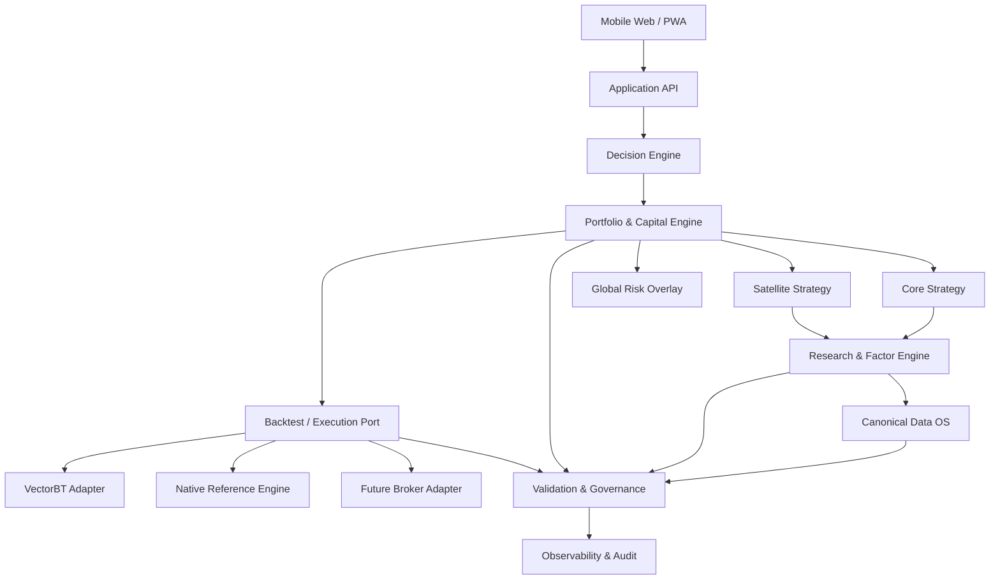

# 01. 总体架构

## 1. 架构风格

系统采用**模块化单体 + 端口适配器（Ports and Adapters）**架构。研究阶段保持单仓库、单进程和清晰模块边界；当真实负载、部署隔离或团队规模证明有必要时，再拆分服务。

不采用早期微服务的原因：

- 当前主要复杂度来自金融语义和数据正确性，而非请求吞吐；
- 分布式系统会引入事务、版本、网络和运维复杂度；
- 模块化单体已经能够实现独立测试、稳定接口和未来拆分。

## 2. 逻辑分层



## 3. 核心层及职责

### 3.1 Domain

只包含长期稳定的金融概念、值对象、协议和不变量，例如：

- Instrument、AssetClass、Sleeve；
- Currency、TradingCalendar；
- PortfolioConstraints；
- TargetWeights、Order、Fill；
- Unit NAV、External Cash Flow；
- ValidationIssue。

Domain 不允许依赖 Web、数据库、VectorBT、Qlib、券商 SDK 或数据源 SDK。

### 3.2 Application

编排用例，不实现底层计算细节。例如：

- 更新市场数据；
- 运行某一策略版本；
- 生成目标权重；
- 执行回测；
- 生成健康报告；
- 产出调仓建议。

### 3.3 Infrastructure

实现外部依赖：

- 数据源 Provider；
- Parquet、DuckDB、PostgreSQL Repository；
- VectorBT、Qlib、券商适配器；
- 缓存、任务调度、日志和通知。

### 3.4 Presentation

对外提供 FastAPI 和 PWA，不直接访问基础设施层。所有响应通过 Application Service 获取。

## 4. 核心数据流

### 4.1 研究数据流

```text
Source API/File
  → Raw immutable snapshot
  → Validation
  → Canonical normalized data
  → Point-in-Time alignment
  → Feature computation
  → Factor scoring
  → Dataset/experiment artifact
```

### 4.2 组合决策流

```text
Asset signals
  → Expected return / regime inputs
  → Base allocation
  → Core/Satellite capital allocation
  → Global risk overlay
  → Currency and concentration constraints
  → Target weights including cash
  → Trigger evaluation
  → Executable orders
```

### 4.3 收益与账户流

```text
Opening positions + cash
  → Market valuation
  → External contribution/withdrawal
  → Units issued/redeemed
  → Rebalance orders
  → Costs and fills
  → Closing NAV and unit NAV
  → TWR / XIRR / attribution
```

## 5. 关键接口

所有接口都应以领域对象或标准 DataFrame/Arrow Table 表达，禁止传递外部框架对象。

```python
class MarketDataRepository(Protocol):
    def load(self, request: MarketDataRequest) -> MarketDataBundle: ...

class FactorModel(Protocol):
    def compute(self, context: FactorContext) -> FactorResult: ...

class AllocationPolicy(Protocol):
    def allocate(self, context: AllocationContext) -> TargetPortfolio: ...

class BacktestEngine(Protocol):
    def run(self, request: BacktestRequest) -> BacktestResult: ...

class ExecutionBroker(Protocol):
    def rebalance(self, plan: OrderPlan) -> ExecutionReport: ...
```

## 6. 一致性边界

### 强一致

- 账户现金、持仓、NAV 和单位份额；
- 每次策略运行使用的数据版本与配置版本；
- 订单、成交和成本对账；
- 审计日志。

### 最终一致

- UI 缓存；
- 长周期报告；
- 非关键行情刷新；
- 实验聚合指标。

## 7. 可扩展点

- 新资产类别：实现 Instrument Metadata、数据适配与风险规则；
- 新因子：实现 FactorModel 并注册元数据；
- 新策略：实现 AllocationPolicy；
- 新回测引擎：实现 BacktestEngine；
- 新数据源：实现 Provider 并通过多源校验；
- 新前端：只依赖版本化 API。

## 8. 架构不变量

1. 领域层不得 import 外部回测或数据 SDK；
2. 所有组合权重必须包含现金并总和为 1；
3. 每次决策必须绑定 `as_of_time`、`data_version`、`strategy_version` 和 `config_hash`；
4. 任何价格、汇率或财务数据都不能隐式向未来填充；
5. 账户计算必须满足每日会计恒等式；
6. 同一策略在不同引擎中必须共享相同的订单和成本语义；
7. 所有自动建议均保留人工覆盖和审计记录。

## 9. 当前到目标的迁移

当前代码已具备 Domain、Factor、Allocation、Backtest 和 Validation 雏形。后续应优先：

1. 重构为明确的 `domain/application/infrastructure/presentation`；
2. 引入版本化配置和运行上下文；
3. 建立 Canonical Data Model；
4. 将原生回测器固定为参考实现；
5. 扩展 Validation 为独立质量门禁；
6. 最后再建设 UI 和实盘适配。
